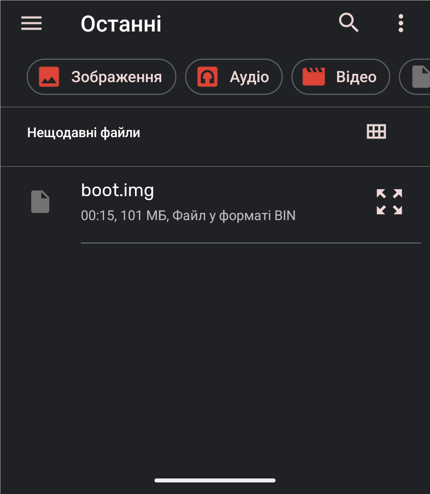
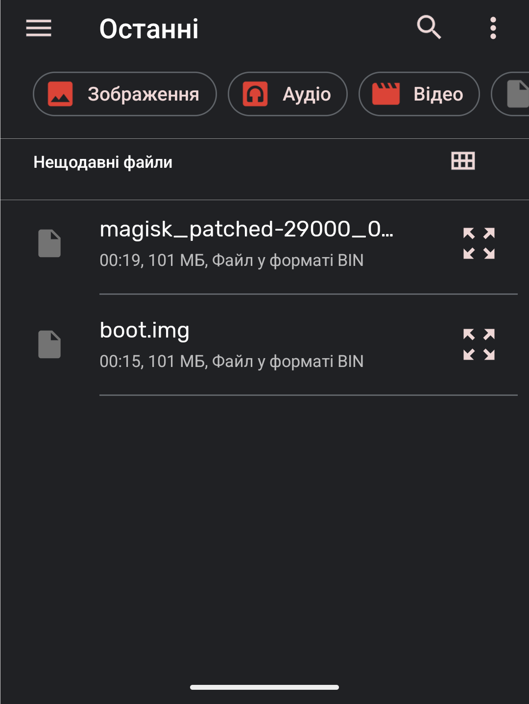

- **Phone:** OnePlus 8 Pro (instantnoodlep)
- **ROM tested**: Evolution X 11.3 & LineageOS 23.0 Nightly (both Android 16)

## 📋 Preparation

### What to download:

1. **boot.img file** - Extract from your ROM

> [!WARNING]
> **⚠️ CRITICAL: boot.img must EXACTLY match your installed ROM!**
> 
> **Wrong combinations = bootloop:**
> ```
> ❌ Evolution X boot.img → LineageOS system
> ❌ LineageOS 22 boot.img → LineageOS 23 system
> ❌ ROM build 2025-01-15 boot.img → build 2025-01-22 system
> ```
> 
> **Correct approach:**
> ```
> ✅ Evolution X 11.3 (20250122) boot.img → Evolution X 11.3 (20250122)
> ✅ LineageOS 23 (20250122) boot.img → LineageOS 23 (20250122)
> ```
  
2. **Magisk** 
   - GitHub: [https://github.com/topjohnwu/Magisk/releases](https://github.com/topjohnwu/Magisk/releases)


> [!CAUTION]
> Highly recommend using `Magisk v29.0`. I tried to use `Magisk v30.3` on Evolution X 11.2 (Android 16) and got broken system and needed to wipe system completely


## Step 1. Check

```cmd
adb devices
```

Should see in cmd: device ✅


## Step 2. Install Magisk Manager
Place APK in `platform-tools` or any other, if ADB is added to Path. Then:

```cmd
adb install Magisk-v29.0.apk
```

## Step 3. Send boot.img to your phone

if image stored on your PC:
```cmd
adb push boot.img /sdcard/Download/boot.img
```

## Step 4. Patch boot.img

1. Open Magisk
2. Select `Install` button in right top
3. Choose `Select and Patch a File`
4. Select pushed `boot.img` 
5. Wait until end of patching

  

<table>
  <tr>
    <td valign="top"></td>
    <td valign="top"></td>
    <td valign="top"></td>
  </tr>
</table>

As result, a new file should appear in `/sdcard/Download` called `magisk_patched-29000_xxxxx.img`  



## Step 5. Move the patched boot back

```cmd
adb pull /sdcard/Download/magisk_patched-29000_xxxxx.img
```

## Step 6. Flash patched boot

```cmd
adb reboot bootloader
fastboot flash boot magisk_patched-29000_xxxxx.img
fastboot reboot
```

> [!IMPORTANT]  
> Recovery only accepts `.zip` files.  
> For `.img` files ONLY fastboot!  


## Step 6.1 Flash both slots (recommended for A/B devices)

> [!NOTE]
> **What are A/B slots?**
> 
> Modern Android devices (including OnePlus 8 Pro) use an **A/B partition system**:
> - **Slot A** (`boot_a`, `system_a`, `vendor_a`) - one complete set of partitions
> - **Slot B** (`boot_b`, `system_b`, `vendor_b`) - second complete set of partitions
> 
> **Why two slots?**
> - Seamless OTA updates (updates install to inactive slot)
> - System can rollback to previous slot if update fails
> - Only one slot is active at a time
> 
> **When to flash both slots?**
> - ✅ If root didn't install properly after flashing single `boot`
> - ✅ To keep root after OTA updates (Magisk in both slots)
> - ✅ If unsure which slot is active
> - ✅ For maximum stability
> 
> **Check active slot:**
> ```cmd
> fastboot getvar current-slot
> ```


**Flash both slots:**
```cmd
# Reboot to bootloader
adb reboot bootloader

# Verify connection
fastboot devices

# Flash patched boot to BOTH slots
fastboot flash boot_a magisk_patched-29000_xxxxx.img
fastboot flash boot_b magisk_patched-29000_xxxxx.img

# Reboot
fastboot reboot
```

> [!TIP]
> Flashing both slots ensures root persists after system updates and slot switches.

## Uninstalling root

To remove Magisk, flash the **stock boot.img** from your ROM:
```cmd
# Flash stock boot to current slot
fastboot flash boot stock_boot.img

# Or to both slots (if you flashed both during installation)
fastboot flash boot_a stock_boot.img
fastboot flash boot_b stock_boot.img

fastboot reboot
```

> [!WARNING]
> Make sure to use the **correct boot.img** matching your current ROM version!  
> Using wrong boot.img = bootloop.

